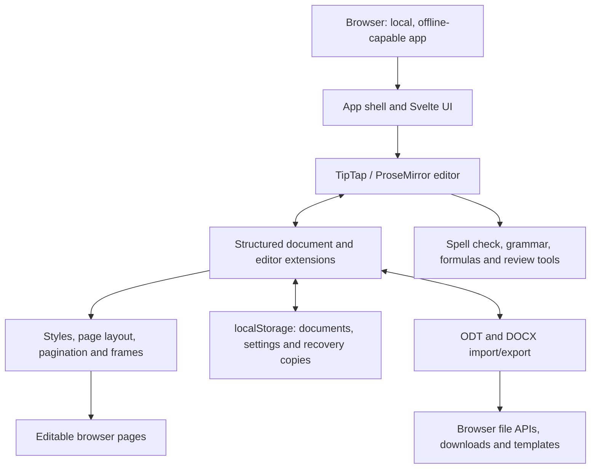

<p align="center">
  
</p>

<h1 align="center">
  
</h1>

<p align="center">
  <strong>Powerful word processor — just one URL away.</strong><br>
  Free · Open Source · Private by Design
</p>

<p align="center">
  <a href="https://github.com/stffnb/edentext/actions/workflows/ci.yml"></a>
  <a href="LICENSE"></a>
  <a href="CHANGELOG.md"></a>
  
</p>

<p align="center">
  <a href="https://edentext.app"><strong>▶ Open EdenText</strong></a>
</p>

---

> [!TIP]
> **This fork adds a Windows desktop app.** Get it from
> [Releases](https://github.com/skonester/edentext/releases): the **setup** installs
> EdenText and opens `.odt` and `.docx` files by double-click, and the **portable
> `.exe`** runs without installing. Built with [Wails](https://wails.io).

EdenText is a web-based, powerful word processor for everything from quick notes to full-length books. No server, no account — processing runs locally and your documents never leave your computer. Just one URL away, or completely offline as a slim browser app — under 2 MB on first load[^1]. The interface comes in English, German, Spanish, French, Portuguese, Russian and Chinese (simplified and traditional).

> [!NOTE]
> EdenText is young, in **beta** and actively developed — more features are on
> the way. It is tested — the full suite plus LibreOffice round-trip checks run
> on every commit — but expect occasional bugs, and keep backups of documents
> you care about. The browser copy also keeps the last three versions of the open
> document, and offers them if it ever fails to load one. What is still missing is
> listed under [Not yet implemented](CHANGELOG.md#not-yet-implemented) and
> [Known limitations](CHANGELOG.md#known-limitations).

<a href="https://edentext.app"><picture>
  <source media="(prefers-color-scheme: dark)" srcset="docs/showcase/thesis-dark.png">
  
</picture></a>

## Features

- **Real page layout** — A4/Letter pages, margins, headers & footers, footnotes,
  columns, page and line numbering, watermarks; mirrored margins and chapters
  opening on a right-hand page for books
- **Opens and saves `.odt` and `.docx`**, exports PDF; templates (`.ott`/`.dotx`)
  and a letter gallery (DIN 5008); password-protected files in both formats
- **Plays well with Word and LibreOffice** — documents keep their layout across
  all three, backed by a sophisticated test pipeline
- **Styles** — paragraph, character, table and list styles with inheritance,
  chapter numbering
- **Tables** with styles, sorting and spreadsheet-style formulas
- **Everything a thesis needs** — table of contents, captions, cross-references,
  citations & bibliography, alphabetical index, formulas (LaTeX)
- **Review tools** — track changes and threaded comments with margin balloons,
  printable markup, spell check and synonyms (English, German, Spanish, French,
  Portuguese and Russian), grammar check (English)
- **Private by design** — your documents never leave your computer, all
  processing runs locally; works offline as an installable app. The site counts
  anonymous visits (GoatCounter, EU-hosted, no cookies); the editor sends nothing
- **Any current browser** — in Chrome and Edge, Save writes back to the opened
  file; other browsers receive each save as a download, so turn on "Always ask
  where to save" in their settings to pick the location

## Gallery

The documents behind these pictures are in [`docs/showcase/`](docs/showcase/) as `.odt`
and `.docx`, ready to open in EdenText, LibreOffice or Word. They are built by
`scripts/showcase/run.mjs`; the photographs are NASA's and the book is Lewis Carroll's,
both public domain.

<table>
<tr>
<td width="50%" valign="top"><a href="docs/showcase/thesis-review.png"></a><br><b>Review</b> — tracked changes, threaded comments in the margin, a draft watermark</td>
<td width="50%" valign="top"><a href="docs/showcase/book-spread.png"></a><br><b>Book</b> — A5, mirrored margins, chapters opening on a right-hand page, running heads; the numbering restarts after the front matter, so page 11 prints the folio 9</td>
</tr>
<tr>
<td width="50%" valign="top"><a href="docs/showcase/newsletter.png"></a><br><b>Newsletter</b> — columns, pictures with captions, a sidebar box</td>
<td width="50%" valign="top"><a href="docs/showcase/newsletter-tables.png"></a><br><b>Tables</b> — table styles and spreadsheet-style formulas</td>
</tr>
</table>

## Development

```bash
npm install
npm run dev      # dev server with hot-reload
npm test         # test suite
npm run build    # production build → dist/
npm run build:desktop  # desktop app → desktop/build/bin/ (needs Go and the Wails CLI)
```

Built with Svelte 5, TypeScript, Vite and TipTap 3 (ProseMirror).

## Self-hosting

There is no backend and no state on the server; documents stay in the browser.
A container image is published for each release (amd64 and arm64):

```bash
docker run -p 8080:80 ghcr.io/stffnb/edentext
```

Or serve the files yourself: every release carries an `edentext-<tag>.zip` of
the built app, and `npm run build` produces the same folder in `dist/` — point
any web server at it, or build the image locally with `docker build -t edentext .`.

## Architecture



EdenText runs entirely in the browser: `App.svelte` composes the interface around
the TipTap document model and its editor extensions. Styles and layout turn that
model into editable pages; storage keeps local state and recovery copies. Import
and export translate the same model to ODT and DOCX, while browser file APIs save
or download the resulting files. See the [architecture guides](docs/architecture/)
for format and layout invariants.

## Contributing

Contributions are welcome — see [CONTRIBUTING.md](CONTRIBUTING.md). Merging
requires a signed [CLA](CLA.md), checked automatically on every pull request.

### Contributors

Thanks to everyone who helped — with ideas, bug reports, testing
and feedback:

- Patrick R. — alpha and beta tester
- [@Deleh](https://github.com/Deleh) — beta tester

<!-- Add a line per person: name or [@handle](https://github.com/handle), then
     " — " and what they contributed. -->


## License

Copyright © 2026 Steffen Becker.

[AGPL-3.0](LICENSE). A [commercial license](LICENSE.commercial.md) is available
for use cases the AGPL does not fit. Bundled fonts and language data keep their
own licenses — see [THIRD-PARTY-NOTICES.md](THIRD-PARTY-NOTICES.md).

*EdenText is an independent project, not affiliated with Microsoft or The
Document Foundation. `.docx` and `.odt` are supported for interoperability.*

[^1]: Over the wire, compressed: ~0.4 MB of app code, the rest the bundled fonts a
    page shows and the spell checker with its dictionary. Further fonts, dictionaries
    and thesauri load on demand; the complete offline install is ~30 MB, or ~38 MB with
    the English grammar check switched on.
